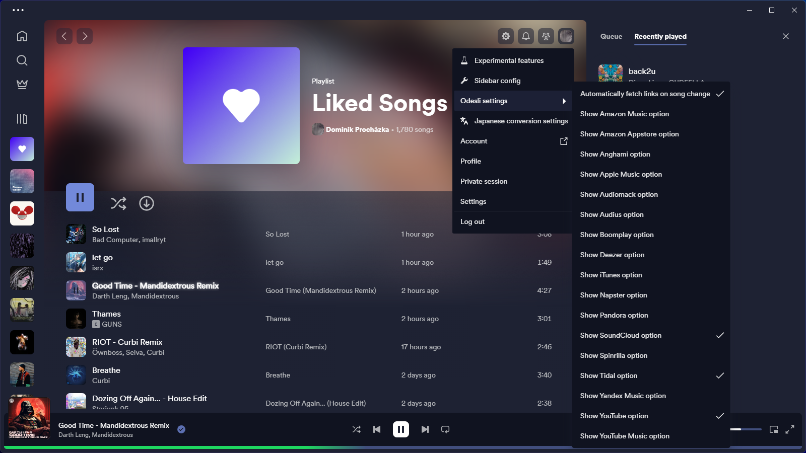
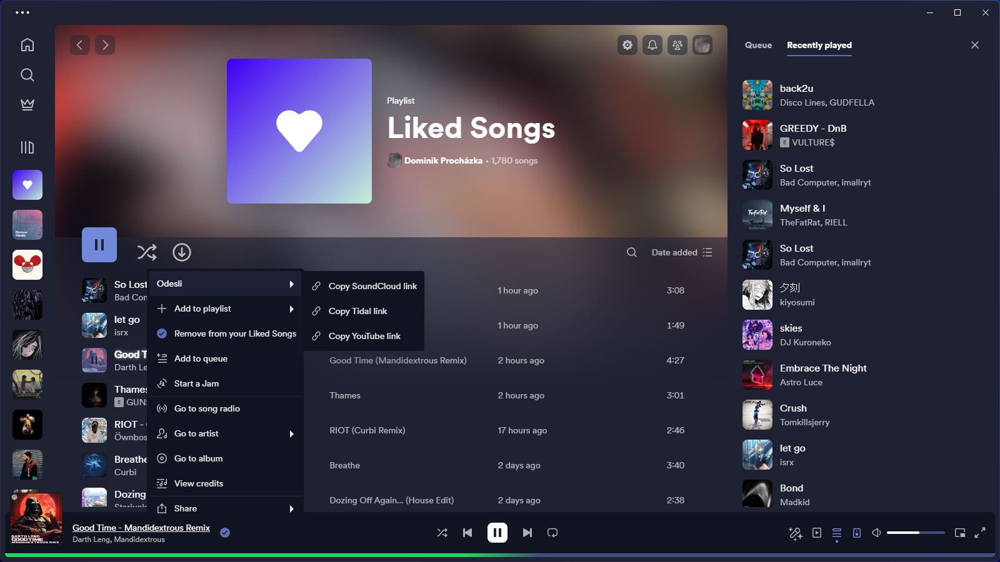

# odesli-spicetify
odesli-spicetify is a Spicetify plugin that integrates the Odesli API straight into the Spicetify client.

## Features
- All platforms supported by Odesli are supported here as well
- All copied songs/albums are cached in the current session to reduce API calls and repeated requests
- Copy links to songs/album from spotify to any other service (obviously availability depends on the artist)
- Choose which services to display in the copy menu
- An option to automatically fetch the song links on song change

## Disclaimer
This plugin fetches your location data from your IP address from a service called IPinfo.io due to the nature of songs being region locked, to provide best performance for you, country code is sent to Odesli to make sure all of the copied links work in your region. If interested, please open a new issue if you want the option to disable this behavior to be added.

## Screenshots

## Building
Make sure you have node.js installed and overall follow the steps in spicetify-creator and then run in the cloned repo directory:\
``npm run build-local``

## Credits
Huge thanks to:
- [Odesli/SongLink](https://odesli.co/)
- [IPinfo.io](https://ipinfo.io/)

Without these services this plugin wouldn't be possible.

## Made with Spicetify Creator
- https://github.com/spicetify/spicetify-creator